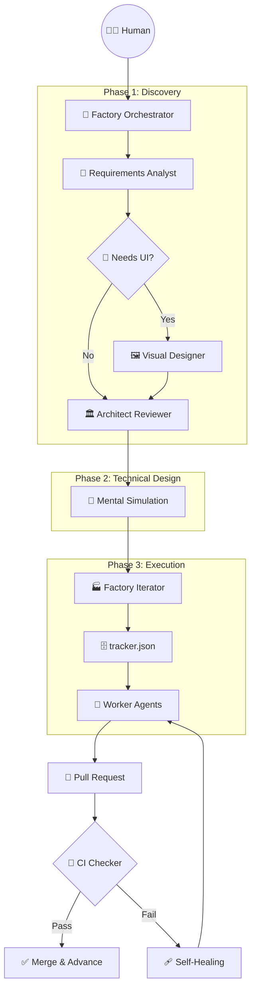

# 🏭 Autonomous Software Factory Workflow

本文件詳述了本框架的權責分立架構與自動化流轉邏輯。

## 🏗️ 核心架構：解耦與編排 (Decoupling & Orchestration)

我們將原本發散的流程收束為五個獨立的 **Skills**，由「編排器 (Orchestrator)」負責引導流程，確保各司其職。

## 🛠️ 技能職責說明 (Skill Responsibilities)

1.  **[Factory Orchestrator](file:///skills/factory-orchestrator/SKILL.md)**: **唯一進入點**。負責管理狀態、決定下一個該執行的 Skill，並根據需求類型跳過不必要的環節（如視覺設計）。
2.  **[Requirements Analyst](file:///skills/requirements-analyst/SKILL.md)**: 專注於中立的需求收集、使用者背景探測、以及意圖分類 (Create/Continue/Maintain)。
3.  **[Visual Designer](file:///skills/visual-designer/SKILL.md)**: **(可選)** 當專案涉及 Web/Mobile UI 時由編排器喚醒。產出 Design System 與畫面佈局。
4.  **[Architect Reviewer](file:///skills/architect-reviewer/SKILL.md)**: 負責技術選型、ADR 與安全性的沙盤推演。
5.  **[Factory Iterator](file:///skills/factory-iterator/SKILL.md)**: 負責執行面的建廠、tracker 產出與微型任務派發。

---

## 🚦 生命週期流轉 (Lifecycle Flow)

- **🟢 CREATE (新案起手)**: 完整走過從分析、設計到產出的完整路徑。
- **🟡 CONTINUE (接續開發)**: 跳過基礎設施 ADR，直接進入功能增量分析與任務拆解。
- **🔴 MAINTAIN (維護修復)**: 極簡化流程，專注於問題診斷與局部代碼審核。
