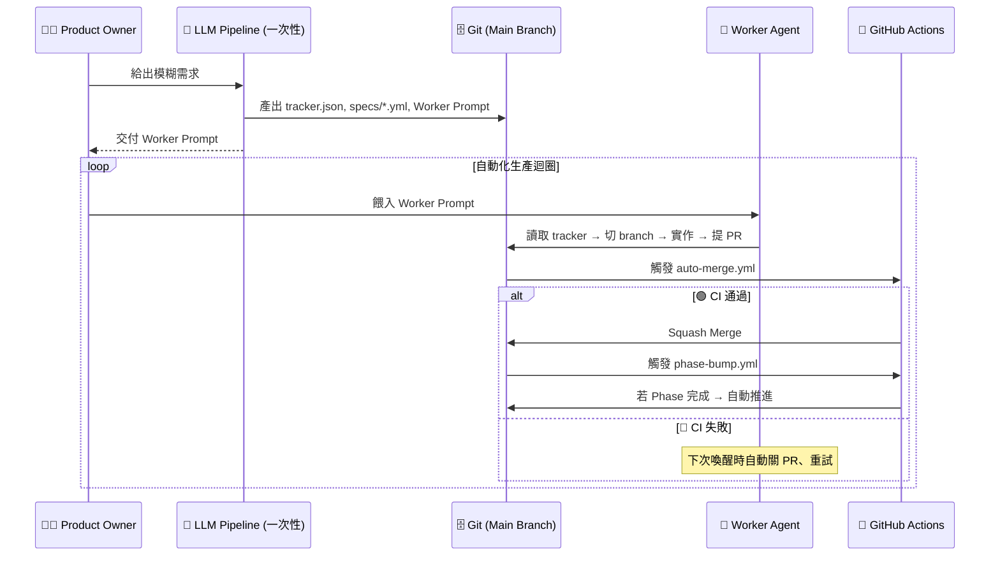

# 🏭 Autonomous Software Factory Framework
> **「這不是一個代碼生成器，這是一座無人值守的軟體工廠。」**

這套框架將「大型軟體開發」抽象化為 **6 個解耦的 AI Skill** 和一個基於 Git 的無伺服器狀態機。
你只需要扮演「發包者 (Product Owner)」，把模糊的願景丟給框架。規劃、拆票、寫扣、測試與合併，全部交由工廠自動流轉。

---

## ✨ 核心特色

| 特色 | 說明 |
|:---|:---|
| 🧠 **6-Role 解耦管線** | 需求分析 → 視覺設計 → 架構審查 → 任務拆解 → 調度教導 → 工人執行，各角色嚴格單一職責 |
| 🎯 **教導者模式 (Instructor Pattern)** | Task Dispatcher 只喚醒一次，產出「可重複使用的 Worker Prompt」。執行階段零 LLM 調度成本 |
| 🛡️ **絕對防爆 CI/CD** | 所有 PR 必須通過 GitHub Actions 測試 + Task Status Guard，Worker 無法繞過 |
| 🗄️ **Git as State Machine** | `tracker.json` 即狀態機。Phase 推進由獨立 CI workflow 自動處理 |
| 🧱 **認知上限守則** | 嚴禁 God Object、檔案 ≤ 300 行、壞了就換不修 |
| 🔁 **自我修復迴圈** | CI 失敗 → Worker 自動關 PR → 遞增 attempts → 重試（≥ 5 次呼救人類）|

---

## ⚡ 快速啟動

### 1. 準備工廠地基
```bash
git clone https://github.com/your-username/app-generator.git my-new-app
cd my-new-app
```

### 2. 喚醒總指揮 (Orchestrator)
打開你偏好的 AI 工具（Claude Code、Cursor、Jules 等），輸入：
> 👉 **「請讀取 `skills/factory-orchestrator/SKILL.md`，你是 Factory Orchestrator 總指揮官，我們準備開工。」**

Orchestrator 會依序引導你走過 5 個階段：
1. **Requirements Analyst** — 需求探測與意圖分類
2. **Visual Designer** *(可選)* — Design Tokens 與 Wireframe
3. **Architect Reviewer** — 技術選型與 ADR 產出
4. **Factory Iterator** — 任務拆解、CI/CD 適配、建廠部署
5. **Task Dispatcher** — 產出可重複使用的 Worker Prompt

### 3. 放牛吃草 (Unleash the Worker)
Dispatcher 會給你一段 **Worker Prompt**。
把這段 Prompt 反覆餵給你的 Worker Agent（例如 Jules），Worker 會自動：
- 讀取 `tracker.json` 尋找任務
- 切 branch、實作、測試、提 PR
- CI 自動 merge + 自動推進 Phase

**直到專案完工為止。**

觸發方式由你決定：Web GUI、API、Cron、n8n 隨便你。

---

## 🏗️ 架構流轉圖



---

## 📁 專案結構

```
├── skills/                          # AI Skill 定義（Prompt 工程）
│   ├── factory-orchestrator/        # 總指揮官
│   ├── requirements-analyst/        # 需求分析師
│   ├── visual-designer/             # 視覺設計師
│   ├── architect-reviewer/          # 架構審查員
│   ├── factory-iterator/            # 任務拆解器 + 模板
│   │   └── assets/templates/        # AGENT_PROTOCOL, auto-merge.yml, phase-bump.yml
│   └── task-dispatcher/             # 任務調度教導者
├── docs/                            # Quarto 文檔門戶
│   ├── FACTORY_WORKFLOW.qmd         # 戰略全景與即時進度
│   ├── worker-protocol.qmd          # 工人行為準則
│   ├── extensions.qmd               # 擴充指南
│   └── principles.qmd              # 設計原則
├── README.md                        # ← 你現在在這裡
└── CHANGELOG.md
```

---

## 🔮 Roadmap

> [!NOTE]
> **分散式 Worker 管理 (Distributed Worker Scheduling)** 是規劃中的未來功能。
> 目前框架以**單一 Worker 串行迭代**運作，所有調度邏輯已抽象至 Task Dispatcher，
> 未來擴充時只需將 Dispatcher 從 `mode: instructor` 升級為 `mode: live`，其餘 Skill 完全不受影響。

---

## 📚 延伸閱讀

- [Factory Workflow Blueprint](docs/FACTORY_WORKFLOW.qmd) — 6-Role 管線的完整架構圖與即時進度
- [Worker Protocol](docs/worker-protocol.qmd) — 工人憲法與邊界測試清單
- [Extensions Guide](docs/extensions.qmd) — 如何接入 Jules、Devin 等 Worker Agent
