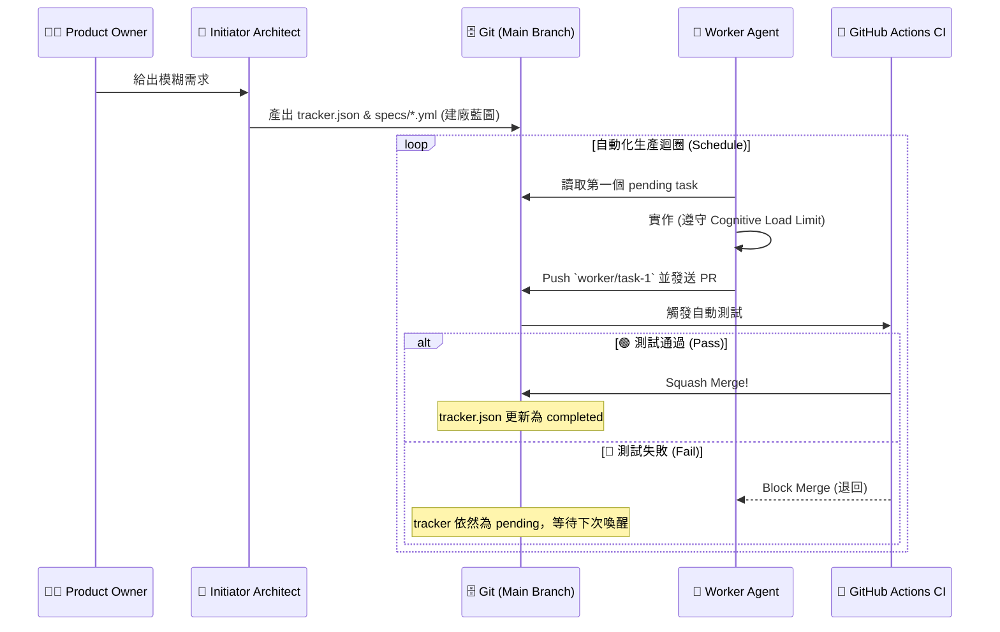

# 🏭 Autonomous Software Factory Framework
> **「這不是一個代碼生成器，這是一座無人值守的軟體工廠。」**

這套框架將「大型軟體開發」抽象化為兩組獨立的 AI Agent (架構師與工人) 以及一個基於 Git 的無伺服器狀態機。
你只需要扮演「發包者 (Product Owner)」，把模糊的願景丟給架構師，剩下的建廠、拆票、寫扣、除錯與合併，全部交由工廠自動流轉。

---

## ✨ 核心特色 (Why this framework?)

*   **🧠 極限解耦 (Decoupling)**：架構師的大腦 (Skills) 與生產線的藍圖 (Templates) 完美分離。修改框架不影響 AI 行為，修改 AI 行為不怕弄壞框架。
*   **🛡️ 絕對防爆 (Defensive Engineering)**：人類不需要看 Log。所有 Agent 產出的代碼必須發送 Pull Request，過不了 GitHub Actions CI/CD 自動測試的 PR，絕對無法進入主分支。
*   **🗄️ Git as a State Machine (無伺服器狀態)**：放棄傳統的資料庫，將任務狀態 (Pending/In Progress/Completed) 綁定於主分支的 `tracker.json`。只要 PR 沒被合併，狀態機就會卡死，形成天然的 **Self-Healing (自我修復迴圈)**。
*   **🧱 認知上限與樂高法 (Cognitive Load Limit)**：嚴格約束 AI 工人「檔案長度不得超過 300 行」、「壞了直接丟掉重寫」。杜絕 AI 產生出連自己都看不懂的義大利麵程式碼。

---

## ⚡ 快速啟動 (Quick Start)

### 1. 準備工廠地基
先將這個框架作為你的範本 (Template)，並在你的本地端或 GitHub Codespaces 開啟：
```bash
git clone https://github.com/your-username/autonomous-software-factory.git my-new-app
cd my-new-app
```

### 2. 喚醒架構師 (The Initiator)
打開你偏好的 AI 工具 (如 Claude Code, Cursor, 或是任何掛載這包資料夾的 LLM)，並丟入起手式：
> 👉 **「請讀取 `skills/factory-initiator/SKILL.md`，你現在是 Factory Initiator 啟動器，我們準備開工。」**

接下來，啟動器會透過 **「雙腦架構 (Dual-Brain)」** 引導你：
1. **Architect (架構決策)**：高階技術選型、ADR 與安全禁令。
2. **Planner (任務規劃)**：將願景拆解為具備 `allowed_paths` 約束的微型任務。
3. **Mental Simulation (沙盤推演)**：預判執行風險。
4. **Scaffolding (建廠部署)**：產出最終藍圖。

### 3. 放牛吃草 (Unleash the Worker)
當架構師產出 `.worker/tracker.json` 與所有規格書後，他的任務就結束了。
接下來，你的自動化腳本或排程服務會定時喚醒 **工人 Agent**，工人會自己讀取 tracker，開始切分支、寫程式、發 PR，直到整個專案自動完成！

---

## 🏗️ 核心架構流轉圖



---

## 📚 工廠操作與進階指南 (Documentation)

準備好深度客製化你的軟體工廠了嗎？請參閱以下文檔：

1. [**核心概念與狀態機 (Core Concepts)**](docs/01-core-concepts.md) - 深入了解 `tracker.json` 為什麼是這座工廠的心臟。
2. [**與架構師溝通 (The Initiator Role)**](docs/02-role-initiator.md) - 解密由三個 Markdown 組成的強逼供大腦。
3. [**工人行事曆與憲法 (The Worker Role)**](docs/03-role-worker.md) - 了解八大破壞性邊界測試與防撞車機制。
4. [**擴充與外掛指南 (Extensions API)**](docs/04-extensions-api.md) - 如何讓 Devin 或是 AutoCoder 也能成為你的工人。
