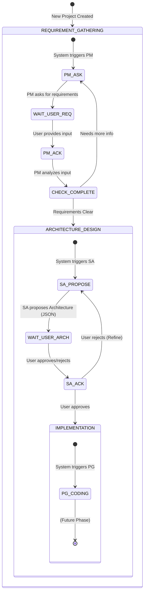

# Agent 狀態機架構指引 (Agent State Machine Architecture)

## 1. 概述 (Overview)

Jules Software Factory 的核心大腦是一個基於狀態機 (State Machine) 的對話驅動引擎。此引擎負責協調多個 AI Agent (PM, SA, PG, UIUX) 與使用者 (User) 之間的互動，並依照標準軟體開發流程 (SDLC) 推進專案進度。

狀態機確保了：
- **職責分離**：每個開發階段由特定的 Agent 負責主導。
- **流程控制**：嚴格定義狀態轉移條件，避免流程混亂。
- **人機協作**：透過 Guard 機制，確保 Agent 在關鍵節點等待使用者確認，避免自言自語或無限迴圈。

## 2. 角色與職責 (Agent Roles & Responsibilities)

系統定義了以下角色 (`AgentRole` Enum)，每個角色在特定的狀態下發揮作用：

| 角色 (Role) | 描述 (Description) | 主要職責 |
| :--- | :--- | :--- |
| **USER** | 使用者 | 發起需求、審核架構、驗收成果、回答 Agent 提問。 |
| **PM** | 專案經理 (Project Manager) | 負責需求訪談 (Requirement Gathering)，釐清專案目標與範圍。 |
| **SA** | 系統分析師 (System Analyst) | 負責架構設計 (Architecture Design)，規劃技術選型、資料庫 Schema 與 API 介面。 |
| **UIUX** | 設計師 (UI/UX Designer) | (規劃中) 負責介面設計與使用者體驗規劃。 |
| **PG** | 程式設計師 (Programmer) | (規劃中) 負責實際程式碼撰寫與實作 (Implementation)。 |
| **SYSTEM** | 系統 (System) | 系統自動生成的訊息或通知。 |

## 3. 專案狀態 (Project States)

專案生命週期由以下狀態 (`ProjectState` Enum) 組成：

| 狀態 (State) | 負責角色 | 描述 |
| :--- | :--- | :--- |
| **REQUIREMENT_GATHERING** | PM | 初始階段。PM 與 User 對話，收集並確認需求。確認無誤後轉移至下一階段。 |
| **ARCHITECTURE_DESIGN** | SA | 架構規劃階段。SA 根據需求產出技術架構方案 (JSON/YAML)，並尋求 User 確認。 |
| **IMPLEMENTATION** | PG | (規劃中) 開發階段。PG 根據架構文件進行程式碼實作。 |
| **REVIEW** | User/QA | (規劃中) 驗收階段。User 或 QA 進行測試與驗收。 |

## 4. 核心狀態轉移圖 (Core State Machine Diagram)

以下 Mermaid 圖表展示了目前的狀態轉移邏輯：



## 5. 資料庫 Schema 設計 (Database Schema)

狀態機的持久化依賴於兩個核心 Entity：`Project` 與 `Conversation`。

### 5.1 Project Entity (`projects`)
記錄專案的基本資訊與當前狀態。

| 欄位 | 型別 | 說明 |
| :--- | :--- | :--- |
| `id` | `BIGINT` | Snowflake ID (Primary Key) |
| `name` | `VARCHAR` | 專案名稱 |
| `description` | `VARCHAR` | 專案描述 |
| `status` | `VARCHAR` | 當前狀態 (Enum: `ProjectState`) |
| `created_at` | `DATETIME` | 建立時間 |
| `updated_at` | `DATETIME` | 更新時間 |

### 5.2 Conversation Entity (`conversations`)
記錄所有的對話歷史，作為 Agent 的 Context window 來源。

| 欄位 | 型別 | 說明 |
| :--- | :--- | :--- |
| `id` | `BIGINT` | Snowflake ID (Primary Key) |
| `project_id` | `BIGINT` | 外鍵關聯至 Project |
| `sender_role` | `VARCHAR` | 發話者角色 (Enum: `AgentRole`) |
| `content_text` | `TEXT` | 對話內容 (Prompt / Response) |
| `content_file_url` | `VARCHAR` | (Optional) 關聯檔案的 S3 URL (如架構圖、程式碼包) |
| `created_at` | `DATETIME` | 建立時間 |

## 6. 實作細節 (Implementation Details)

### 6.1 StateMachineEngine & Strategy Pattern

核心引擎 `StateMachineEngine` 採用 **Strategy Pattern** 實作。它不包含具體的業務邏輯，而是根據專案當前的 `ProjectState`，委派給對應的 `StateHandler` 實作類別處理。

- **Interface**: `StateMachineEngine`
  - `void processEvent(StateContext context)`: 接收外部觸發 (如 User 輸入)，驅動狀態機運作。**注意：此方法不應標註 `@Transactional`，以避免 LLM 長時間呼叫佔用資料庫連線。**

- **Interface**: `StateHandler`
  - `boolean supports(ProjectState state)`: 判斷是否支援當前狀態。
  - `void handle(StateContext context)`: 執行該狀態下的業務邏輯 (呼叫 LLM、更新 DB、轉換狀態)。
  - `AgentRole getResponsibleRole()`: 回傳該狀態的負責角色 (用於 Guard 檢查)。

### 6.2 Guard 機制 (防止無限迴圈)

為了防止 Agent 在等待 User 回覆時自我觸發造成無限迴圈，`StateMachineEngine` 實作了 **Guard Check**：

```java
// 偽代碼示例
AgentRole responsibleRole = handler.getResponsibleRole();
Conversation lastMsg = getLastMessage(context);

if (lastMsg.getSenderRole() == responsibleRole) {
    // 若最後一條訊息是負責該階段的 Agent 發出的，表示正在等待 User 回覆。
    // 系統將中斷執行，不呼叫 handle()。
    return;
}
```

這確保了 "Turn-taking" (輪流發言) 的機制： **User Input -> Agent Process -> Agent Reply -> Wait for User Input**。
